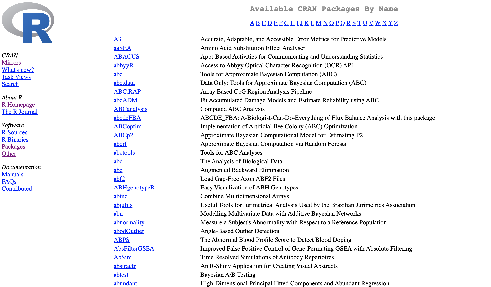

```{r setup, include=FALSE}
options(htmltools.dir.version = FALSE)
knitr::opts_chunk$set(fig.align="center", fig.width=5, fig.height=5, warning = FALSE, message = FALSE)
```

```{r xaringan-themer, include = FALSE}
library(xaringanthemer)
duo_accent(
  primary_color = "ivory",
  secondary_color = "midnightblue",
  header_font_google = google_font("Roboto", "400"),
  text_font_google   = google_font("Lato", "300"),
  code_font_family = "Fira Code",
  code_font_url = "https://cdn.rawgit.com/tonsky/FiraCode/1.204/distr/fira_code.css",
  header_color = "#f54278",
  title_slide_text_color = "#354a66"
)
```


---
### What are functions?

<b>**function**</b>: reusable code that performs a well-articulated task 

--

--

What types of task:

--

  * return a value e.g. <tt>max</tt> gives the largest of a set of values
  
--
  
  * other actions e.g. <tt>plot</tt> creates graphs
  
  


---
### How to use


  * calling functions, use the function name followed by <tt>()</tt> 

--
  
  * arguments: the inputs to functions
    
    * placed inside the <tt>()</tt>
    
    * some arguments may be mandatory; others optional
    
--

  * get help by using <tt>?</tt> before function name. Help page will show in the help window.

```{r}
?plot
```
  


---
### Where do you get functions

We can think of 3 sources of functions:

--

  * built-in to R e.g. <tt>plot</tt>, <tt>max</tt>, <tt>table</tt>, <tt>summary</tt>
  
--
  
  * installed via packages 
  
--
  
  * you can write your own 
  


---
### What is a package?

A **package**: is a collection of functions and data. 

Some examples:
  
  * ggplot2: a package with graphical functions 
  
  * dplyr and tidyr: packages for data wrangling
  
  * caret: a package for machine learning
  
  * data.table: a package for making operations with extremely large data sets fast
  
  
---
### CRAN

Comprehensive R Archive Network (CRAN): The official repository of packages for the R language.

```{r echo = FALSE}

```

---
### Installing and using packages 

  * <tt>install.packages</tt>
    * only needs to be run once to install the package. 
    
    * gets the package from the Comprehensive R Archive Network (CRAN)
    

#### Example: Installing the genius package

```{r eval = FALSE}
install.packages("genius")
```

---
### 

<tt>library</tt>: gives you access to the functions and data of a package that is already installed

#### Example: 

First try to use the <tt>genius_lyrics</tt> function of the <tt>genius</tt> package: 
--
```{r error = TRUE}
sg <- genius_lyrics(artist = "Kes", song = "Savannah Grass")
```


--

Now use <tt>library</tt>: 

```{r}
library(genius)
sg <- genius_lyrics(artist = "Kes", song = "Savannah Grass")

```

---
```{r eval = FALSE}
sg
```
```{r echo = FALSE}
reactable::reactable(sg)
```


---
### Writing our own functions 

Write a function th 
  * input: 
    * a vector of variables
    * a number **n**
    
  * action: identifies the n most common values in the list 
  


---  
###  
  
What are the steps?

  * Calculate the counts of 
  
  * Sort the counts 
  
  * Identify the n most common 
  
  * return the identified values
  

---  
###  
  
Do these steps correspond to functions we are familiar with?

  * Calculate the counts of
    * we can use <tt>table</tt>
  
  * Sort the counts 
    * we can use <tt>sort</tt>
  
  * Identify the n most common
    * subsetting
  
  * return the identified values
  

  
