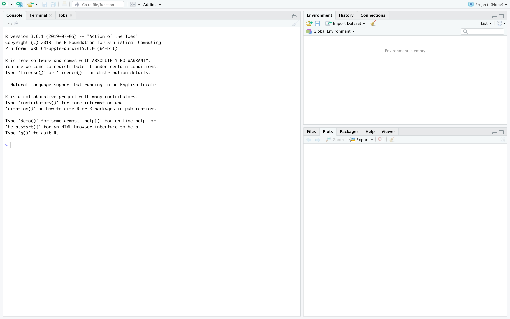

## 1. Install R and RStudio

  * Download R @ The [R Project’s Home Page](https://cloud.r-project.org/)
    
    * Windows: 
      * [https://cloud.r-project.org/bin/windows/base/R-3.6.2-win.exe](https://cloud.r-project.org/bin/windows/base/R-3.6.2-win.exe)
    
    * Mac: 
      * [https://cloud.r-project.org/bin/macosx/R-3.6.2.pkg](https://cloud.r-project.org/bin/macosx/R-3.6.2.pkg)
    * Linux
      * [https://cloud.r-project.org/bin/linux/](https://cloud.r-project.org/bin/linux/)
    
  * Download RStudio Desktop from [RStudio](https://www.rstudio.com/products/rstudio/download/#download)
    * Windows
      * [https://download1.rstudio.org/desktop/windows/RStudio-1.2.5033.exe](https://download1.rstudio.org/desktop/windows/RStudio-1.2.5033.exe)
    * Mac
      * [https://download1.rstudio.org/desktop/macos/RStudio-1.2.5033.dmg](https://download1.rstudio.org/desktop/macos/RStudio-1.2.5033.dmg)
    * Linux
      * [https://www.rstudio.com/products/rstudio/download/#download](https://www.rstudio.com/products/rstudio/download/#download)
  
  * Run the installers for R and RStudio, in that order.
  
## 2. Open RStudio

It should look like this when you do:


## 3. Install additional packages and data
  
  * copy-paste the text below into the command window 
  * hit enter
  * accept any defaults if you get prompted
  * this may take a while
  
```{r eval = FALSE}
install.packages("tidyverse")
install.packages("devtools")
library(devtools)
install_github("thisisdaryn/workshop")
install.packages("nycflights13")
```

## 4. Test it out

**Copy-paste the following text into the command window and hit enter**. 

  * If the picture shows up then you have installed all the necessary packages.
  * Don't worry if you don't understand the commands. 

```{r message = FALSE, warning = FALSE}
library(ggplot2)
library(workshop)
library(stringr)

big_depts <- names(sort(table(chi_emps$Dept), decreasing = TRUE)[1:5])
df <- chi_emps[chi_emps$Dept %in% big_depts, ]
ggplot(data = df, aes(x = Dept, y = AnnSalary)) + geom_boxplot()

lara_tests <- separate(lara, Match, into = c("Format", "Matchnum")) %>% 
  filter(Format == "Test")

ggplot(lara_tests, aes(x = Opp, y = Runs)) + geom_bar()

```


 

